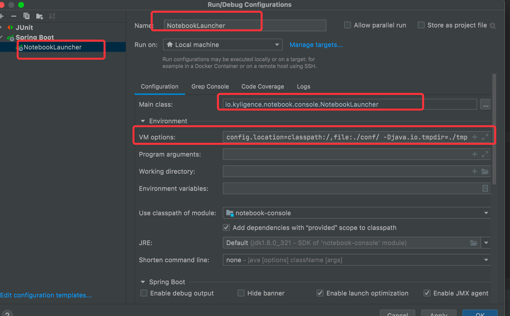

# NoteBook开发环境搭建

本章节将会介绍如何搭建 Byzer Notebook 的开发环境。

### 前置条件

byzer-notebook 相当于一个Web服务，依赖于 byzer-lang 服务的 SQL 解析和执行，所以要启动 byzer-notebook 需要先启动 byzer-lang，具体参考这篇 https://docs.mlsql.tech/mlsql-stack/dev_guide/engine/spark_3_0_0.html

### 开发环境搭建概览

1. 下载 byzer-notebook 和 byzer-notebook-vue

2. 安装 node 和 npm 

3. idea 配置

4. 启动 byzer-notebook 和 byzer-notebook-vue

### 下载项目

1. 下载地址：
- [byzer-notebook](https://github.com/byzer-org/byzer-notebook)
- [byzer-notebook-vue](https://github.com/byzer-org/byzer-notebook-vue)

  1. 下载命令

     `git clone https://github.com/byzer-org/byzer-notebook byzer-notebook
      
     git clone https://github.com/byzer-org/byzer-notebook-vue byzer-notebook-vue
     ` 
  2. 【可选】向社区贡献代码步骤
     1. for 项目源码到自己的私有仓库
     2. checkout 出自己的本地分支 dev
     3. 本地分支 dev 提交代码并 push 到远程 dev
     4. 将自己私有仓库的 dev 分支代码向社区 master 分支提交 Pull Request 贡献代码给社区 review

### 安装node和npm
1.下载node和npm

Node安装包：http://nodejs.cn/download/

选择对应操作系统的安装包进行安装，本次采用Mac版本，安装好后已安装完 node 和 npm 

2. 【可选】安装/降级到指定版本的node和npm
   
   由于之前本机安装的 node 和 npm 版本比较高，执行 npm install 命令会报如下错误：
   
  

   需要降级到指定的版本才行，如本次将版本降到 14.18.3
   
   node 和npm 降级命令：

   1. 安装 n 模块，sudo npm install -g n

   2. 安装 n 模块后，n -V 查看版本

   3. 最后升级指定版本的 nodejs，sudo n 14.18.3

   4. 用 node -v 查看版本，14.18.3
   

### idea 配置

 本次采用idea作为开发环境，在启动 byzer-notebook 前需要添加相关VM配置才能启动，配置如下：

`-DNOTEBOOK_HOME=/Users/jiasheng.lian/Documents/Kyligence/code/byzer-notebook
-Dspring.config.name=application,notebook
-Dspring.config.location=classpath:/,file:./conf/
-Djava.io.tmpdir=./tmp`

### 启动 byzer-notebook 和 byzer-notebook-vue

#### 启动 byzer-notebook 

1. 重命名 conf/notebook.properties.example 文件为自己指定的配置文件名称

2. 修改配置文件中的 notebook.database 相关配置，本次采用的是 mysql5.7.26
   `notebook.database.type=mysql
   notebook.database.ip=127.0.0.1
   notebook.database.port=3306
   notebook.database.name=notebook
   notebook.database.username=root
   notebook.database.password=root`
3. 修改配置文件中的 notebook.mlsql.engine-url 为自己本地的 byzer-lang服务地址
   `notebook.mlsql.engine-url=http://localhost:9003
   notebook.mlsql.engine-backup-url=http://localhost:9004`
4. 启动类 io.kyligence.notebook.console.NotebookLauncher 的 main 方法启动项目，启动后默认项目地址为 http://localhost:9002 ，
   但是这个只是个后端服务，想要体验前端页面，需要再启动 byzer-notebook-vue

### 启动 byzer-notebook-vue

1. npm install 安装依赖包
2. npm run serve 热加载启动项目
3. 【可选】安装/降级到指定版本的node和npm

   由于之前本机安装的 node 和 npm 版本比较高，执行 npm install 命令会报如下错误：

需要降级到指定的版本才行，如本次将版本降到 14.18.3

node 和 npm 降级命令：

1. 安装 n 模块，sudo npm install -g n

2. 安装 n 模块后，n -V 查看版本

3. 最后升级指定版本的 nodejs，sudo n 14.18.3

4. 用 node -v 查看版本，14.18.3

### 浏览器访问

   访问 `http://localhost:9002`

   

输入账号密码: `admin/admin`，这样本地的 Byzer Notebook 的开发环境已搭建完成，开始探索 Byzer Notebook 吧。

   
   
   
